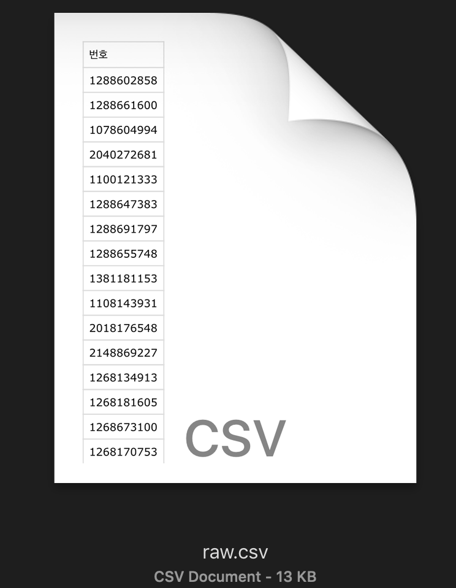

## 사업자 상태 조회
홈텍스 사이트에서 사업자 상태를 자동으로 조회하는 코드입니다.
UTF-8로 인코딩된 .csv 파일만을 대상으로 합니다.

## 사용법
.csv 파일의 첫 번째 열에 사업자번호가 있어야 합니다.
다운로드 하여 해당 폴더 안에 .csv 파일을 'raw.csv' 라는 이름으로 위치시켜 둡니다.



이후 app.py를 실행하면 'edited.csv' 라는 이름으로 조회가 끝난 새 .csv 파일이 생성됩니다.
조회할 대상이 많을 경우 시간이 다소 소요될 수 있습니다.

## 필요사항
python version 3.5.2
requirements.txt

## 패키지 설치법
파이썬 패키지 관리자(ex. pip)를 설치하여 requirements.txt 설치.
예시) 
```
pip install -r requirements.txt
```